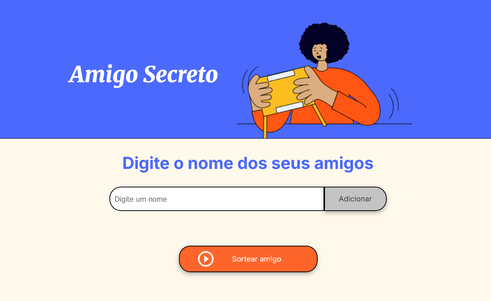

# 🎁 Amigo Secreto

Este é um projeto em HTML, CSS e JavaScript que simula a dinâmica de adicionar nomes de amigos e realizar um sorteio aleatório de um deles.

---

## 📌 Funcionalidades

✅ Adicionar nomes de amigos manualmente  
✅ Exibir dinamicamente a lista de amigos  
✅ Sortear aleatoriamente um dos amigos adicionados  
✅ Exibir o amigo sorteado na tela  
✅ Validação de entrada para evitar campos vazios  

---

## 🖼️ Interface

A interface é limpa e amigável, com campos de entrada, botões e listas organizadas. O sorteio pode ser acionado com um clique.

---

## 🚀 Tecnologias utilizadas

- **HTML5**
- **CSS3**
- **JavaScript**

---

## 📂 Estrutura de arquivos

projeto-amigo-secreto/
├── index.html                      
├── style.css                       
├── app.js                          
├── assets/                         
│   ├── amigo-secreto.png           
│   ├── pagina-amigo-secreto.png    
│   └── play_circle_outline.png     
└── README.md                       

---

## 🖥️ Como usar

1. Clone este repositório ou baixe os arquivos em `.zip`
2. Abra o arquivo `index.html` no navegador
3. Digite os nomes no campo e clique em **Adicionar**
4. Clique em **Sortear amigo** para ver o resultado

---

## 📸 Captura de tela (opcional)

---

## 👨‍💻 Autor

Desenvolvido por Fábio.  
Feito para fins de aprendizado e prática de JavaScript. (Oracle Next Education)

---

## 📝 Licença
> [!NOTE]
> Este projeto está sob a licença MIT. Sinta-se à vontade para usar, modificar e compartilhar.
